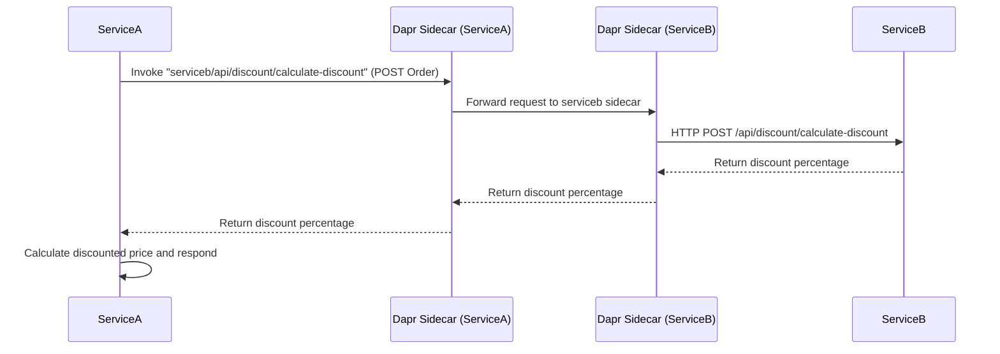

# Service Discovery / Invocation

**.NET Aspire** + **DAPR** - Service Discovery / Invocation

```mermaid
sequenceDiagram
    participant ServiceA
    participant SidecarA as Dapr Sidecar (ServiceA)
    participant SidecarB as Dapr Sidecar (ServiceB)
    participant ServiceB

    ServiceA->>SidecarA: Invoke "serviceb/api/discount/calculate-discount" (POST Order)
    SidecarA->>SidecarB: Forward request to serviceb sidecar
    SidecarB->>ServiceB: HTTP POST /api/discount/calculate-discount
    ServiceB-->>SidecarB: Return discount percentage
    SidecarB-->>SidecarA: Return discount percentage
    SidecarA-->>ServiceA: Return discount percentage
    ServiceA->>ServiceA: Calculate discounted price and respond

```
